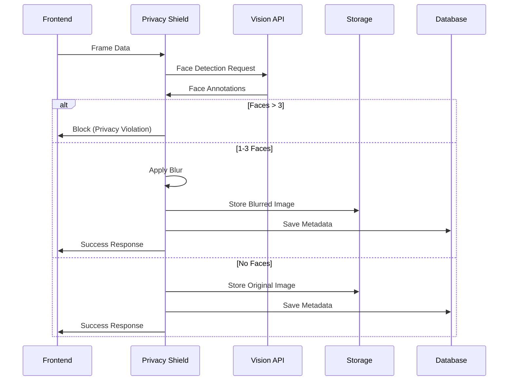
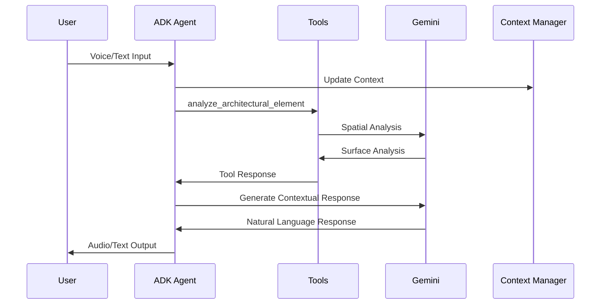

# Architectural Alchemist - System Architecture

## Overview Diagram

```mermaid
graph TB
    %% Frontend Layer
    subgraph "Frontend (Next.js)"
        A[Web Browser] --> B[Video Capture]
        A --> C[Audio Input]
        A --> D[WebRTC Client]
        A --> E[UI Components]
    end

    %% Communication Layer
    subgraph "Real-time Communication"
        D --> F[WebRTC Connection]
        F --> G[aiortc Bridge]
    end

    %% Backend Layer
    subgraph "Backend (FastAPI on Cloud Run)"
        G --> H[ADK Agent Manager]
        H --> I[Conversation Manager]
        H --> J[Interruption Handler]
        
        %% API Routes
        K[API Router] --> L[/webrtc]
        K --> M[/spatial]
        K --> N[/snapshot]
        K --> O[/gallery]
        K --> P[/process-frame]
    end

    %% Privacy Layer
    subgraph "Privacy Shield"
        Q[Privacy Shield Service]
        R[Face Detection]
        S[Image Blurring]
        T[Crowd Blocking]
        Q --> R
        Q --> S
        Q --> T
    end

    %% AI Services
    subgraph "Google AI Services"
        U[Gemini Live API]
        V[Gemini 1.5 Pro]
        W[Gemini Vision API]
        U --> G
        V --> M
        W --> Q
    end

    %% Data Layer
    subgraph "Google Cloud Services"
        X[Cloud Storage]
        Y[Firestore Database]
        Z[Artifact Registry]
    end

    %% Infrastructure Layer
    subgraph "Infrastructure"
        AA[Google Cloud Run]
        BB[Terraform/Cloud Build]
        CC[Cloud CDN]
        DD[Load Balancer]
    end

    %% Connections
    P --> Q
    M --> V
    N --> X
    N --> Y
    O --> X
    O --> Y
    L --> U
    
    %% Deployment Flow
    BB --> AA
    BB --> Z
    AA --> DD
    DD --> CC

    %% Styling
    classDef frontend fill:#e1f5fe
    classDef backend fill:#f3e5f5
    classDef privacy fill:#fff3e0
    classDef ai fill:#e8f5e8
    classDef data fill:#fce4ec
    classDef infra fill:#f1f8e9

    class A,B,C,D,E frontend
    class F,G,H,I,J,K,L,M,N,O,P backend
    class Q,R,S,T privacy
    class U,V,W ai
    class X,Y,Z data
    class AA,BB,CC,DD infra
```

## Data Flow Architecture

### Real-time Video Processing Flow
1. **Frontend** captures video/audio via WebRTC
2. **WebRTC Bridge** establishes bidirectional connection to Gemini Live
3. **Privacy Shield** processes frames for face detection
4. **ADK Agent** manages conversation and interruptions
5. **Spatial Analysis** provides architectural insights

### Privacy Protection Flow


### ADK Integration Flow


## Technology Stack

### Frontend Technologies
- **Next.js 14** - React framework with static export
- **TypeScript** - Type-safe development
- **Tailwind CSS** - Utility-first styling
- **WebRTC API** - Real-time video/audio streaming
- **Framer Motion** - Smooth animations

### Backend Technologies
- **FastAPI** - Modern Python web framework
- **ADK (Agent Development Kit)** - Google's agent framework
- **aiortc** - WebRTC server implementation
- **Pillow** - Image processing
- **WebSockets** - Real-time communication

### Google Cloud Services
- **Gemini Live API** - Real-time multimodal AI
- **Gemini 1.5 Pro** - Spatial reasoning
- **Cloud Vision API** - Face detection and analysis
- **Cloud Run** - Serverless container hosting
- **Cloud Storage** - Image storage with signed URLs
- **Firestore** - NoSQL document database
- **Artifact Registry** - Container registry
- **Cloud Build** - Automated CI/CD

### Infrastructure as Code
- **Terraform** - Infrastructure provisioning
- **Docker** - Containerization
- **Bash Scripts** - Deployment automation

## Security & Privacy Features

### Privacy Shield Implementation
- **Server-side face detection** using Google Vision API
- **Automatic blurring** of detected faces (Gaussian blur, radius=15)
- **Crowd blocking** - Reject images with >3 faces
- **Signed URLs** - Temporary access (15-minute expiration)
- **Content filtering** - Real-time frame processing

### Security Measures
- **CORS configuration** for cross-origin requests
- **Environment variable validation** on startup
- **Service account isolation** with minimal permissions
- **Input validation** and sanitization
- **Error handling** without information leakage

## Deployment Architecture

### Cloud Run Configuration
- **Auto-scaling**: 0-10 instances
- **Memory**: 1Gi per instance
- **CPU**: 1 vCPU per instance
- **Timeout**: 300 seconds
- **Concurrency**: 10 requests per instance

### CI/CD Pipeline
1. **Code push** triggers Cloud Build
2. **Docker image** built and pushed to Artifact Registry
3. **Terraform** provisions infrastructure
4. **Cloud Run** deploys new version
5. **Health checks** verify deployment

## Performance Optimizations

### Real-time Optimizations
- **Frame rate limiting**: 1 FPS for processing
- **Lazy loading** of GCP clients
- **Connection pooling** for database access
- **Caching** of signed URLs
- **Compression** of images (JPEG quality 70-80)

### Scalability Features
- **Horizontal scaling** via Cloud Run
- **Asynchronous processing** with asyncio
- **Queue management** for media streams
- **Graceful degradation** under load

## Monitoring & Observability

### Logging Strategy
- **Structured logging** with JSON format
- **Correlation IDs** for request tracing
- **Error categorization** and alerting
- **Performance metrics** collection

### Health Checks
- **Liveness probe** at `/health`
- **Readiness checks** for dependencies
- **Graceful shutdown** handling
- **Circuit breaker** patterns for external APIs
